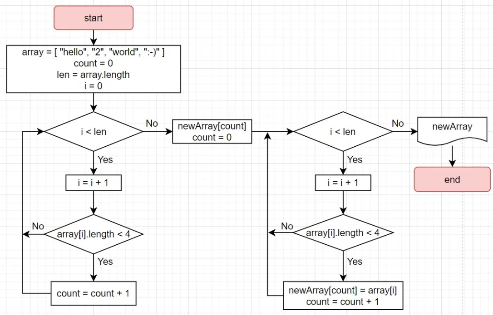

## *Описание решения данной задачи*

**В данной задаче заранее инициализирован массив.**

Массив с которым будем работать - выводится в консоль через вспомогательный метод, затем с помощью вспомогательного метода формируется новый и следом в консоль выводится новый массив (Чтобы было видно разницу).

string[] GetStringSizeLessThan4(string[] array) - основной метод для решения задачи.

void ShowArrayString(string[] array) - вспомогательный метод для проверки работы основного

Блок схема кода:
